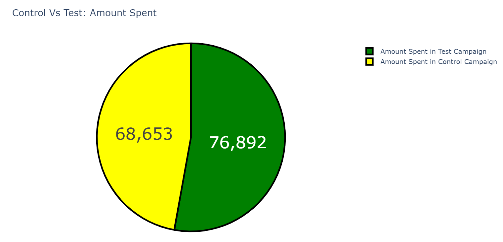
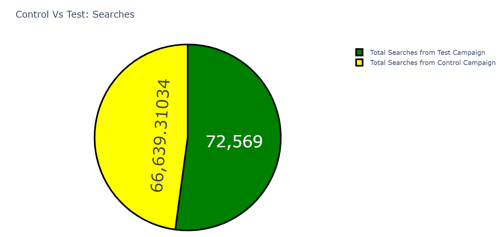
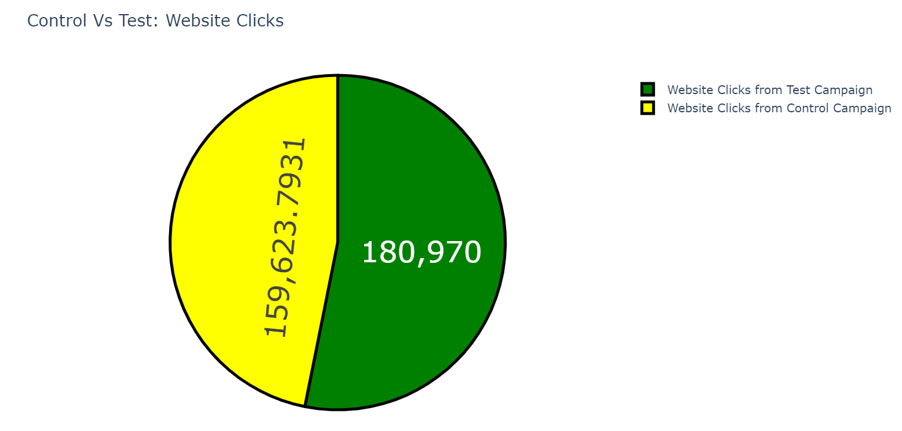
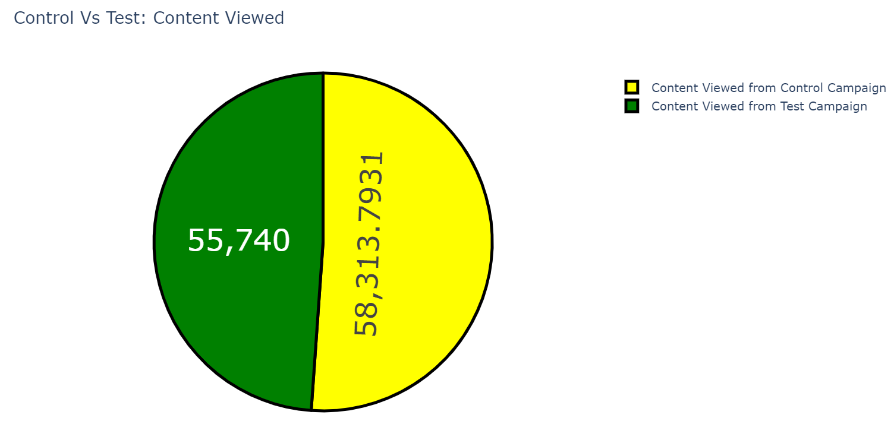
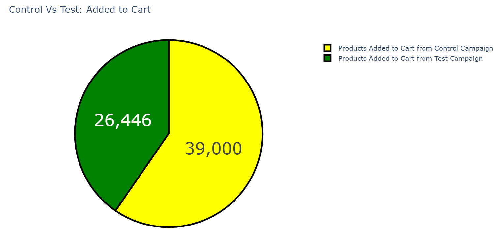
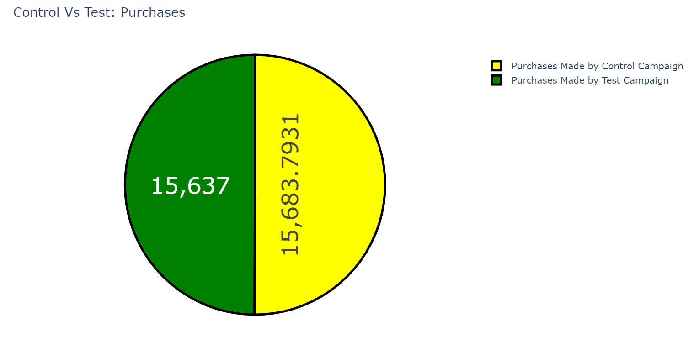
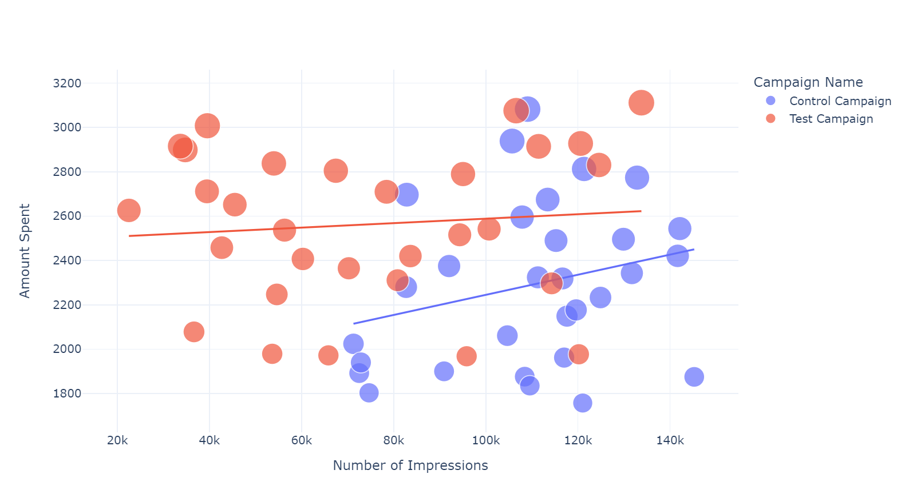
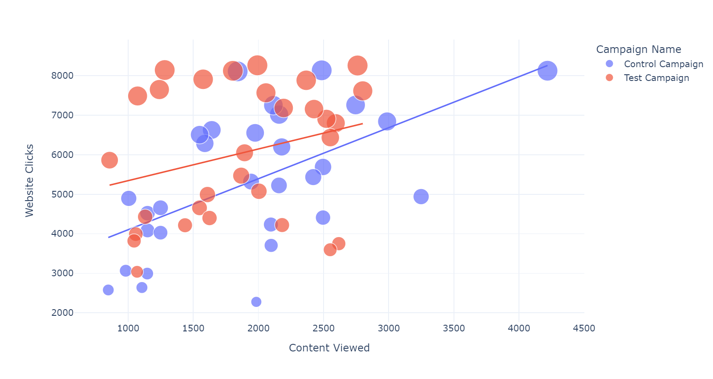
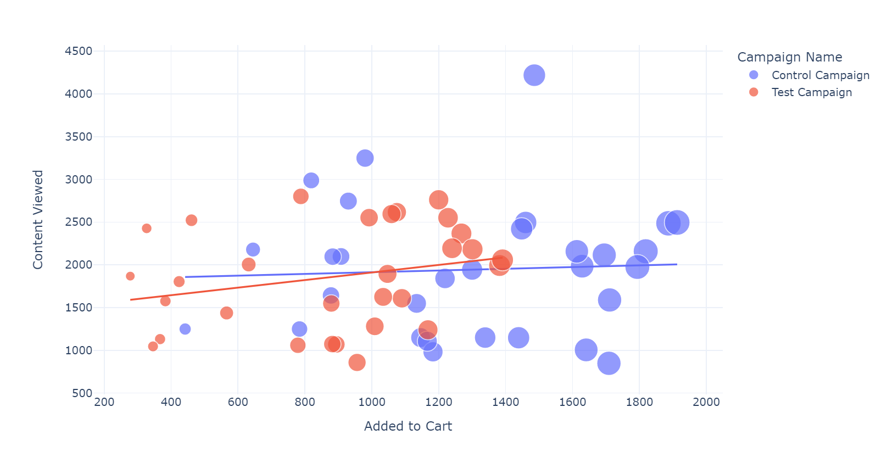
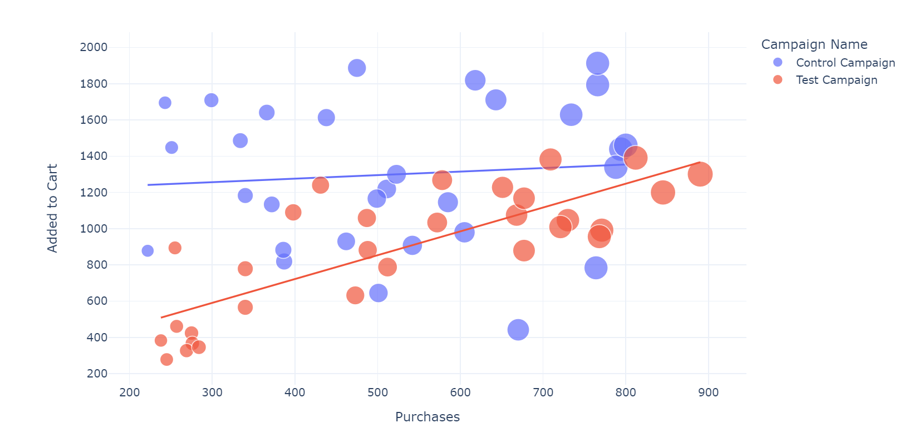

# A/B Testing

## Purpose
The purpose of this project was to compare the marketing strategies between two groups using A/B testing.
Graphs created using Plotly.

## Results

#### Amount Spent from Both Campaigns

- Test campaign spent more money

#### Searches Received from Both Campaigns

- Test campaign received more searches

#### Number of Website Clicks from Both Campaigns

- Test campaign received more website clicks

#### Content Viewed from Both Campaigns

- Control campaign had more content viewed

#### Number of Products Added to Cart from Both Campaigns

- Control campaign had more products added to cart

#### Purchases from Both Campaigns

- Difference in purchases is negligible at .2% in favor of control campaign

#### Amount Spent vs Number of Impressions

- Control campaign has more impressions with less money spent 

#### Website Clicks vs Content Viewed

- Website clicks are higher for the test campaign, but engagement is higher in control campaign

#### Content Viewed vs Added to Cart

- Control campaign had a higher conversion of content viewed to items added to cart

#### Added to Cart vs Purchases Made

- Test campaign had a higher conversion rate of items added to cart to purchases made

## Conclusion

- Control Campaign
    - More sales overall
    - Conversion rate is higher from content viewed to items added to cart

- Test Campaign
    - Greater conversion rate from items added to cart and purchases made

The Control campaign should be utilized to market multiple products to a large audience.
The Test campaign should be utilized to market a specific item to a targeted audience.